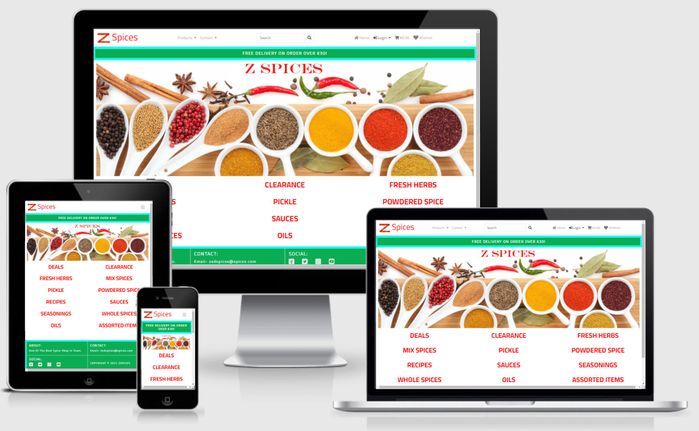
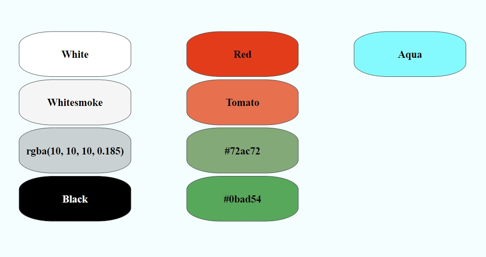

# Milestone Project Four -  Z  Spices
ZSpice is a spice shop website. It sells a veriety of spices. The taget audience of ZSpice shop are the peiple who look for good quality spices.

To visit the website please click [Hare](https://zspices.herokuapp.com/)

## Contents

- [**User Experience (UX)**](<#user-experience-(ux)>)

  - [Project Goals](#project-goals)
  - [User Goals](#user-goals)
  - [Design](#design)
  - [Wireframes](#wireframes)

- [**Features**](#features)

  - [Existing Features](#features)

- [**Technologies**](#technologies-used)

  - [Languages Used](#technologies-used)
  - [Frameworks, Libraries and Programs Used](#technologies-used)

- [**Testing**](#testing)

- [**Deployment**](#deployment)

## User Experience (UX)

### Project Goals
- Create a website to sell high-quality spices.
- Create and implement navigation throughout the site to help users to register, log in and buy products  
  and post rating and reviews about the products.
- Implement  CRUD (create, read, update and delete) functionalities for site owner so, he will be able     
  to add new products and edit/delete the existing products.  
- Implement following technologies:  
CSS, HTML, JavaScript, Python and django'.  

## User Stories

### User Goals:
#### New User Goals:  
As a new user, I want to achieve the following goals.  
a- I want to be able to view all product.    
b- I want to be able to register on the website.  
c- I want to be able to make a wishlist of the products for future buying.    
### Returning User Goals:  
a- As a returning user, I want to be able to log in and log out.  
b- As a returning user, I want to be able to access my save wishlist.  
c- As a returning user, I want to be able to add or delete products from my wishlist.  
### Site Owner User Goals:  
a- As the site owner, I want to be able to add new products and edit/delete the existing products on the website.  
b- As the site owner, I want to attract the audience with the nice and attractive design of the website.  

### Design  
* The design of this project is simple.  
Bootstrap 4.4 framework was used to build this project website.  

### Colors  
* I used followig colours including text colors.  

  

## Features

### Existing Features : 

- **Navigation**:  
  A Bootstrap-based navigation bar has added with the company logo and company name on the left in desktop and mobile view.
  - **Desktop Navbar**  
  The desktop navbar shows Products, Contact, Home, Login/Profile, Shopping-cart/Shopping-bag and Wishlist links. A product search bar is also available in the desktop navbar.  
  - **Mobile Navbar**  
  In mobile navbar Products, Contact, Home, Login/Profile, Shopping-cart/Shopping-bag and Wishlist links and search bar is hidden in the dropdown menu.  

- **Footer**:  
The footer includes the email address and Social link icons.

- **Home Page**:  
The landing page contains a beautiful hero image.

- **Profile**:  
Once a user logged in, the login link changed into Profile link. 

- **Search**:  
Users can search their required products using the search function available inthe navbar.  

**Security**  
Django "allauth" app used for security. This app provide following functions.  
- User registration including email verification 
- User Log in  
- User Log out  
- Password Recovery  
- Database configurations, username, password/"secret key" for Heroku, Stripe and AWS S3 are stored in a separate file, and gitpod's .gitignore file was used to prevent this file from uploading to GitHub.  

## Technologies Used
- Following languages and frameworks were used to build the website

### Languages

 [HTML5](https://en.wikipedia.org/wiki/HTML5)
>
 [CSS3](https://en.wikipedia.org/wiki/Cascading_Style_Sheets)
>
 [JavaScript](https://en.wikipedia.org/wiki/JavaScript)

 [Python](https://en.wikipedia.org/wiki/Python_(programming_language))

### Frameworks, Libraries and Programs:  

 [Django](http://www.djangoproject.com/)  
  
 [GitHub](https://github.com/github)

 [Gitpod](https://www.gitpod.io/) 

 

 [Font Awesome](https://fontawesome.com/) 

 [Balsamiq](https://balsamiq.com/) 

