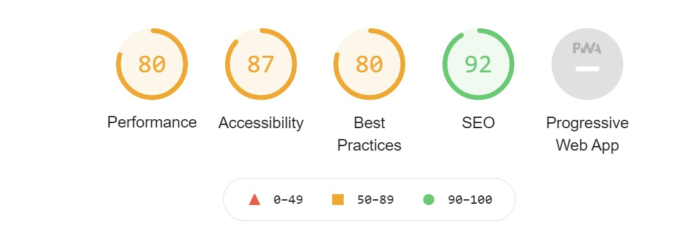

# Milestone Project Four -  Z  Spices
ZSpice is a spice shop website. It sells a veriety of spices. The taget audience of ZSpice shop are the peiple who look for good quality spices.

To visit the website please click [Here](https://zspices.herokuapp.com/)


## Contents

- [**User Experience (UX)**](<#user-experience-(ux)>)

  - [Project Goals](#project-goals)
  - [User Goals](#user-goals)
  - [Design](#design)
  - [Wireframes](#wireframes)

- [**Features**](#features)

  - [Existing Features](#features)

- [**Technologies**](#technologies-used)

  - [Languages Used](#technologies-used)
  - [Frameworks, Libraries and Programs Used](#technologies-used)

- [**Testing**](#testing)

- [**Deployment**](#project-deploy)

## User Experience (UX)

### Project Goals
- Create a website to sell high-quality spices.
- Create and implement navigation throughout the site to help users to register, log in and buy products  
  and post rating and reviews about the products.
- Implement  CRUD (create, read, update and delete) functionalities for site owner so, he will be able     
  to add new products and edit/delete the existing products.  
- Implement following technologies:  
CSS, HTML, JavaScript, Python and django'.  

## User Stories

### User Goals:
#### New User Goals:  
As a new user, I want to achieve the following goals.  
a- I want to be able to view all product.    
b- I want to be able to register on the website.  
c- I want to be able to log in and log out.    
d- I want to be able to add the products in wishlist for future buying.    
### Returning User Goals:  
a- I want to be able to access my saved wishlist.  
b- I want to be able to add or remove products from my wishlist.  
### Site Owner Goals:  
a- I want to be able to add new products.   
b- I want to be able to edit/delete the existing products on the website.  

### Design  
- The design of this project is simple.  
Bootstrap 4.4 framework was used to build this project website.  

### Colors  
- I used followig colours including text colors.  

  

## Features

### Existing Features : 

This  milestone-4 project consists of eight data models and six apps.   

1. Accounts/Registration:  
- Registration: A user can register his/her account, upon successful registration a confirmation email is sent to the user's provided email address. When the user verifies this email, the user's account is registered.
- Login/logout: A user can easily log in and log out.  
- Password reset: If a user forgets the password, and click "Forgot Password?" on the login page a new page opens asking for the registered email address. After supplying the required information, the user receives a password reset email.  

2. Site Navigation:  The navbar is available across the site, it allows the user to do the following:

- Browse the site by "All products", "Price" and "category".
- Browse the products through the Search functionality.
- User can log in log out.
- Authenticated users can access their profiles.
- Authenticated users can access their wishlist.
- Access to shopping bag via the shopping cart icon.

3. Landing Page:  
  On landing page links for all product categories are available.  

4. Products App:  
- Prduct Page:  
On this page a user can sort the products by Price, Size, Name and Category.  

- Product Details Page:  
This page shows the product details. Users can choose the quantity and add it to the bag.  
Product rating : Porduct rating option is available for authenitacted users.  
Quantity : Users can choose from 1 to 99  of a particular product to add to shopping bag.    
Authenticated users can add or remove the product from the wishlist and post the ratings and product reviews.  
- site owner: 
Can edit/update a product.   
Can delete a product  

5. Wishlist App:  
 Authenticated users can view and remove the products from their wishlist. The wishlist items are saved and available for returning users.  

6. Profiles App:  
- Personalized profile page: A registered user can fill-up a default delivery/shipping details on their profile page which will be used during their checkout to make it process faster and more convenient.
- Previous orders summary: A users profile page shows asummary of all previous orders.  

5. Shopping_bag:  
- Displays selected products to be purchased. 
- Users can add and reduce product quantity from the shopping bag and the cost will adjust accordingly 
- Users can remove products from the shopping bag and cost will adjust accordingly.  
- Proceed to checkout page

6. Checkout App:
- If a user is authenticated and has a profile the delivery/shipping form will be pre-populated with their saved pieces of information and if the user is not authenticated the form will be empty 
- A summary of the products & costs which a user is about to purchase will be available on display next to the delivery/shipping form.
- Stripe secure card validation: the card entered by the user will be validated in real-time by stripe and if the card is validated, the purchase will go through and the user will be automatically redirected to the success page showing order confirmation details.
- Upon successful purchase a confirmation email is sent to the user, containing the order summary.  

**Security**  
Django "allauth" app used for security. This app provide following functions.  
- User registration including email verification 
- User Log in  
- User Log out  
- Password Recovery  
- Database configurations, username, password/"secret key" for Heroku, Stripe and AWS S3 are stored in a separate file, and gitpod's ".gitignore" file was used to prevent this file from uploading to GitHub.  

### Future Features  
- Show the avarage rating of the products.  
- Impliment an email sending form at contact page.

## Technologies Used
- Following languages and frameworks were used to build the website

### Languages

 [HTML5](https://en.wikipedia.org/wiki/HTML5)
>
 [CSS3](https://en.wikipedia.org/wiki/Cascading_Style_Sheets)
>
 [JavaScript](https://en.wikipedia.org/wiki/JavaScript)

 [Python](https://en.wikipedia.org/wiki/Python_(programming_language))

### Frameworks, Libraries and Programs:  

 [Django](http://www.djangoproject.com/)  
  
 [GitHub](https://github.com/github)


 [Gitpod](https://www.gitpod.io/) 

 

 [Font Awesome](https://fontawesome.com/) 

 [Balsamiq](https://balsamiq.com/) 

### Font  
Google cairo font used in this project.  

### Skeleton or Wireframe    
Please click [Here](static/pdf/Milestone-4.pdf) to download wireframe of this project.  

### Database  
Please click [Here](static/pdf/Database.pdf) to download database model diagram.  

## Testing

**PEP8 Compliant:**  
I used [PEP8](http://pep8online.com/) to check python files complied with the PEP8 requirements. 
  

**W3C CSS Validator**   
I used the online [W3C CSS Validator](https://jigsaw.w3.org/css-validator/) to check the validity of my CSS file. Test was passed with **no** error.  

**W3C HTML Validator**  
I used the online [W3C HTML Validator](https://validator.w3.org) to check the validity of my HTML code for each page. Test was passed with **no** error, except django/jinja template errors.  

**JSHINT**  
I used  [JSHINT](https://jshint.com/) to check validity of my JS code and there was no error.  

## Testing User Stories  
#### Testing New User Goals:   
* ### a - I want to be able to view all product.  
    On the landing page, I click on the "Products" dropdown menu and then click again on " View All Products".  The product page displayed all products.  

* ### b- I want to be able to register on the website. 
  I clicked on the "Login" dropdown menu on the navbar and then clicked on "Register" a sigh up form appear. I filled it with the required pieces of information and click on "Sign Up". The following message appeared.  
  ### "Verify Your E-mail Address. We have sent an e-mail to you for verification. Follow the link provided to finalize the signup process. Please contact us if you do not receive it within a few minutes."  
  After verification of the Email, I was registered on the site.  

* ### c- I want to be able to log in and log out.  
    To Log in, I clicked on the "login" link and filled the details in the "Sign In" form and clicked on the "Sign In" link. I was logged in and the "Login" link on the navbar was changed into the "Profile" Link.  
    
* ### d- I want to be able to add the products in wishlist for future buying.  
  To add a product to the wishlist, I clicked on the "ADD TO WISHLIST" button on the product detail page. The product was successfully added to my wishlist.  

### Testing Returning User Goals:  
* ### a- I want to be able to access my saved wishlist.  
  To access my wishlist, I clicked on the "Wishlist" link at the navbar, my wishlist appeared with all the items, which I saved here on my last visit.  

* ### b- I want to be able to add or remove products from my wishlist.  
  1- To remove a product from my wishlist, I clicked on the "Remove" link given below the product image and the product was removed from my wishlist.   
  2- To remove a product from my wishlist, I clicked on the "REMOVE FROM WISHLIST" button on the product details page and the product was successfully removed from my wishlist.

### Site Owner Goals:  
* ###  a- I want to be able to add new products.  
    I logged in using my super-suer/site-owner credentials. I clicked on the "Profile" dropdown menu on the navbar, and I clicked on the " Product Management" link. An " Add a Product" form appeared. After filling in all the required information I clicked on the "Add Product" button and the product was successfully added.  
    Note:  
    1- The "Product Management" link is only available for super-users or site-owner.  
    2- I get all the product images from the internet so,  to meet the project requirements I added a credit URL field in the "Add a Product" form. This makes it easy to add credits every time I add a new product.  

* ### b- I want to be able to edit/delete the existing products on the website.  
  I logged in using my super-suer/site-owner credentials. Delete and Edit links appeared with each product on the Product page and Product Details page.   
  To edit a product I clicked on the edit link beside a product. An "Edit a Product" form appeared pre-populated with the details of that product. After editing the product details I clicked on the "Update Product" button and the Product was successfully Updated.  
  To delete a product I clicked on the Delete link besides the product. A confirmation page appeared asking " Are you sure to delete the product". I clicked on the "Delete" button and the product was successfully deleted.  

### Further Testing  
- Browsers  
The website was tested on Chrom, Firefox, Cclean, Edge, Opera and InternetExplorer. It is working great on all browsers.  Only InternetExplorer does not support webP image format. To show the webP based hero image following code is added in base.html.  
  

### Chrom Lighthouse Result
  

- Mobile Devices  
The website was tested on Samsung A70 and OPPO A74 5G.  It works well on these devices.  

## Bug  
When I deployed the project on Heroku/AWS S3, the red coloured logo name and categories name on the home page turned to their default blue colour. To make their colour again red,  I used the "important" keyword. And the logo name on the navbar and categories name became again red.
 
## Project Deploy

## Deploying Website at Heroku.com  

Before you start deployment, please install `dj_database_url` and `psycopg2` apps.  
`pip3 install dj_database_url`  
`pip3 install psycopg2`  
Create a requirements.txt file - `pip3 freeze > requirements.txt`  
Create a `Procfile` (note the capital P), and add the following,
`web: gunicorn moose_juice.wsgi:your application name`  

1. Create an account on Heroku and log in
2. Create a new app, choose a location nearest to you
3. Search for Heroku Postgres from the resources tab and add to your project
4. Login to the Heroku CLI - `heroku login -i`
5. Run migrations on Heroku Postgres - `heroku run python manage.py migrate`
6. Create a superuser - `python manage.py createsuperuser`
7. Install `gunicorn` - `pip3 install gunicorn`  
8. Disable Heroku from collecting static files - `heroku config:set DISABLE_COLLECTSTATIC=1 --app <your-app-name>`  
9. Add the hostname to project settings.py file
```
ALLOWED_HOSTS = ['<you-app-name>.herokuapp.com', 'localhost']

```
10. Connect Heroku to you Github, by selecting Github as the deployment method and search for the github repository and pressing `connect`
11. In Heroku, within settings, under config vars select `Reveal config vars`
12. Add the following, 
```
AWS_ACCESS_KEY_ID =	<your variable here> (keep it empty until you get key from AWS)
AWS_SECRET_ACCESS_KEY =	<your variable here> (keep it empty until you get key from AWS)
DATABASE_URL =	<Get this key from Heroku when Postgres installed>
DISABLE_COLLECTSTATIC =	1 (1= No static file will load to Heroku. 0= Static files will load to  
                            Heroku).  
EMAIL_HOST_PASS = <your variable here>
EMAIL_HOST_USER = <your variable here>
SECRET_KEY = <your variable here>
STRIPE_PUBLIC_KEY = <your variable here>
STRIPE_SECRET_KEY = <your variable here>
STRIPE_WH_SECRET = <different from env.py>
USE_AWS = True
```
13. Go back to the Deploy tab and under Automatic deploys choose `Enable Automatic Deploys`
14. Back in your CLI add, commit and push your changes and Heroku will automatically deploy your app
```
git add .
git commit -m "Some commit meaaage"
git push
```
15. Your deployed site can be launched by clicking `Open App` button from your app page within Heroku.

**AWS S3 Bucket setup**
1. Create an Amazon AWS account
2. Search for S3 and create a new bucket  
    - write your bucket name  
    - Choose the AWS region near to you  
    - Enable ACLs 
    - Uncheck Block all public access and checkin the acknowledgement
    - Click on Create bucket button
3. Click on your newly created bucketand click on Properties > Static website hosting > edit> Enable  
    - Enable
    - index.html as index.html
    - error.html as error.html  
    - save
4. Under Permissions > CORS use the following:
```
[
  {
      "AllowedHeaders": [
          "Authorization"
      ],
      "AllowedMethods": [
          "GET"
      ],
      "AllowedOrigins": [
          "*"
      ],
      "ExposeHeaders": []
  }
]
```
5. Under Permissions > Bucket Policy:
    - Generate Bucket Policy and take note of Bucket ARN
    - Chose S3 Bucket Policy as Type of Policy
    - For Principal, enter *
    - Enter ARN noted above
    - Add Statement
    - Generate Policy
    - Copy Policy JSON Document
    - Paste policy into Edit Bucket policy on the previous tab
    - Save changes
6. Under Access Control List (ACL):
    - For Everyone (public access), tick List
    - Accept that everyone in the world may access the Bucket
    - Save changes

**AWS IAM (Identity and Access Management) setup**
1. From the IAM dashboard within AWS, select User Groups:
    - Create a new group
    - Click through and Create Group
2. Select Policies:
    - Create policy
    - Under JSON tab, click Import managed policy
    - Choose AmazongS3FullAccess
    - Edit the resource to include the Bucket ARN.
    - Click next step and go to Review policy
    - Give the policy a name and description
    - Create policy
3. Go back to User Groups and choose the group created earlier
    - Under Permissions > Add permissions, choose Attach Policies and select the one just created
    - Add permissions
4. Under Users:
    - Choose a user name 
    - Select Programmatic access as the Access type
    - Click Next
    - Add the user to the Group just created
    - Click Next and Create User
5. Download the `new_user_credentials.csv` file. This file contains the access key and secret access key.
    - **THE `.csv` FILE IS ONLY AVAILABLE THIS TIME AND YOU CANNOT  DOWNLOAD IT AGAIN.**

**Connecting Heroku to AWS S3**
1. Install boto3 and django-storages  
` pip3 install boto3`  
` pip3 install django-storages`  
` pip3 freeze > requirements.txt`  

2. Add the values from the `new_user_credentials.csv` you downloaded to your Heroku Config Vars     under Settings.
3. Change `DISABLE_COLLECTSTATIC` variable value  from 1 to 0 in Heroku Config Vars under Settings.
4. Commit and push your code from gitpod terminal.
5. Heroku will pull static files from gitpod and will push them to the AWS S3 bucket in a folder   named static.  
6. Create a new folder with name media (at the same level as the newly added static folder) and upload all the file from the media folder in your gitpod workspace.

7. You have successfully deployed your project.  

**Creating a Clone**

1. From the repository, click *Code*
2. In the *Clone >> HTTPS* section, copy the clone URL for the repository  
3. Make a new repository on github and open the workspace in gitpod.
4. Open a terminal andrun the command
`git clone https://github.com/mqsaud/zedspices.git`
5. Change the directory and go into project directory.  
6. Run migrate
7. Create superuser  
8. The cloned project is ready
9. Please make a new env.py or .env file and put the values of secret.  

## Project-Life-cycle
The development life cycle of the project consists of the following steps.

Concept.
Feasibility and Research
User experience and sketch
Coding
Testing
Hosting
Future Maintainability
1. Concept
The Project starts from an Idea or Concept. In this Project, the concept of a spice shop website and a Plant shop were selected.

2. Feasibility and Research
I discussed the feasibility of these concepts with my mentor, and he gave an okay signal for the Spice Shop website

3. User Experience and sketch
Using the User Experience guidelines, I draw the sketches of all pages of the website. I used Balsamiq wireframe software to draw the sketches.

4. Coding
HTML5, CSS3, Python and javaScript are the main software used to build this project. Django web frame work was used to develop this project. Bootstrap 4.6 framework was used to give a stylish and professional look to the project. Github and gitpod online platform was used to write and save the project. Gitpod's version control system was used for version control. Microsoft VS Code IDE built-in gitpod was used for code writing. Heroku  and AWS S3 platforms was used to host the project.  

5. Testing  
  Two methods were adopted to test this project.  
a. Manual Testing  
b. Third-Party Test services  

a. Manual Testing  
In this method, the website was opened in different web browsers and checked every page, link and button.  

b. Third Party Testing services  
W3C validation services were used to validate HTML and CSS files.  
I used JSHINT to check validity of my JS code.  
Chrome Lighthouse Dev tool was used to check the website performance.  
http://ami.responsivedesign.is/ was used to check the responsiveness of the website.  

6. Hosting
Heroku.com and AWS S3 cloud hosting service used to host the website.

7. Future Maintainability
For future maintainability CSS and all HTML pages are divided into sections. Meaningful names of HTML IDs and CLASSes were chosen to facilitate the developer who may work on this project in future.

Contents
All cotents are written by me.

Media  
Most of the pictures are taken from internet. All credits are given at the point of use.  

### Credits
A large amount of code is refered to Code Institute, Boutique Ado tutorial.  
For the imahes of the products, I added a URL field in product model. No product can be registered without writing the credit in this field.  
Django Documentation: https://docs.djangoproject.com/en/4.0/  
Bootstrap Documentation: https://getbootstrap.com/docs/4.6/getting-started/introduction/

### Acknowledgment
Special thanks to my mentor Mr Sandeep Aggarwal, who took a keen interest in my project. He guided me to resolve the CSS issues and some security flaws in python code.  
Code Institute tutor support.

#### [Back to Contents](#contents)


